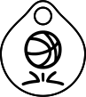
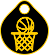

# Abzeichen im Mini Basketball

  

    <a href="abzeichen/dribbel/" class="badge-link">
      
      <h3>Dribbling</h3>
    </a>
  

  

    <a href="abzeichen/pass/" class="badge-link">
      
      <h3>Pass</h3>
    </a>
  

  

    <a href="abzeichen/wurfabzeichen/" class="badge-link">
      
      <h3>Wurf</h3>
    </a>
  

  

    <a href="abzeichen/korbleger/" class="badge-link">
      
      <h3>Korbleger</h3>
    </a>
  

  

    <a href="abzeichen/teamwork/" class="badge-link">
      
      <h3>Teamwork</h3>
    </a>
  

## Idee & Konzept

Die **Abzeichenreihe** im Mini Basketball dient dazu, Fähigkeiten auf spielerische und motivierende Weise zu fördern. Die Kinder stellen sich individuellen Herausforderungen in verschiedenen Bereichen wie Werfen, Passen, Dribbeln, Korbleger oder Teamwork.

Durch das Sammeln von Abzeichen erleben die Kinder ihre Fortschritte bewusst und erhalten Anerkennung für ihren Einsatz im Training und Spiel.

Die Abzeichen sind als weiterer Ansporn nach Bestehen der [DBB Abzeichen](https://www.basketball-bund.de/jugend/spieltreff-und-spielabzeichen/) gedacht. Mit dem DBB Goldabzeichen beherrschen die Kinder bereits die grundlegenden Fähigkeiten im Basketball. Die hier dargestellten Abzeichen fördern die weitere Entwicklung dieser Fähigkeiten.

Der Schwierigkeitsgrad ist so ausgelegt, dass ein Spieler bis zum Erreichen der U12 alle Abzeichen erreichen kann - Fleiß und Übung vorausgesetzt. Aber auch nach dem Wechsel in die U12 (oder für Kinder die später zum Basketball gekommen sind) stellen sie noch eine ausreichende Herausforderung dar.

---

## Aufbau der Abzeichen

Jedes Abzeichen ist in **drei Stufen** unterteilt, die sich im Schwierigkeitsgrad und in der geforderten Spielkompetenz unterscheiden:

- ⚪ **Stufe 1: Starter**  
  Erste Grundlagen, Techniken und einfache Anwendung  
- ⚫ **Stufe 2: Profi**  
  Gesteigerte Anforderungen, Sicherheit und Flexibilität  
- 🟡 **Stufe 3: Champion**  
  Anwendung unter Zeitdruck oder im Spielkontext  

Die Stufen sind **altersgerecht konzipiert** und fördern nicht nur technische Fertigkeiten, sondern auch Konzentration, Fairness und Spielintelligenz.

---

## Ablauf & Bewertung

- Die Kinder können die Übungen im Training erlernen und beliebig oft üben.  
- Jede Stufe wird vom Trainer überprüft und bei Bestehen auf dem Abzeichenblatt unterschrieben.  
- Das Erreichen einer Stufe ist ein **Zeichen von Fleiß, Disziplin und Entwicklung**, es steht nicht der Vergleich mit Anderen im Vordergrund.  

Die Teilnahme ist **freiwillig**, soll aber **Leistungsfreude und persönlichen Fortschritt belohnen** – unabhängig vom Talent oder der bisherigen Erfahrung.

---

## Warum Abzeichen?

- Klare Ziele geben Kindern Orientierung.  
- Abzeichen schaffen **sichtbare Erfolgserlebnisse**.  
- Kinder lernen: **Übung, nicht Talent**, macht den Unterschied.  
- Das Konzept stärkt **Selbstvertrauen, Disziplin und Motivation**.

---

## Material

Derzeit gibt es keine offiziellen Materialen. Die Abzeichen sind als SVG verfügbar und können je nach Budget und Fähigkeit selbst hergestellt werden. Für meine Mannschaft habe ich die Abzeichen mit einem 3D Drucker erstellt. Die Abzeichen sind als Anhänger gedacht, so können sie am Bund an der Sporttasche oder am Ranzen getragen und präsentiert werden. Alternativ können die Abzeichen auch als Sticker, Ansteckbutton oder Magnet gefertigt werden - es gibt diverse Dienste im Internet um dies umzusetzen.

### Farben

Die Abzeichen sind in folgender Farbkombination gedacht:

* **Starter**: Hintergrund Weiß, Vordergrund Schwarz
* **Profi**: Hintergrund Silber, Vordergrund Weiß
* **Champion**: Hintergrund Schwarz, Vordergrund Gold

### Downloads

* **Dribbling** ([Starter](Dribbling.svg), [Profi](Dribbling_Profi.svg), [Champion](Dribbling_Champ.svg))
* **Pass** ([Starter](Pass.svg), [Profi](Pass_Profi.svg), [Champion](Pass_Champ.svg))
* **Wurf** ([Starter](Wurf.svg), [Profi](Wurf_Profi.svg), [Champion](Wurf_Champ.svg))
* **Korbleger** ([Starter](Layup.svg), [Profi](Layup_Profi.svg), [Champion](Layup_Champ.svg))
* **Teamwork** ([Starter](Teamwork.svg), [Profi](Teamwork_Profi.svg), [Champion](Teamwork_Champ.svg))
